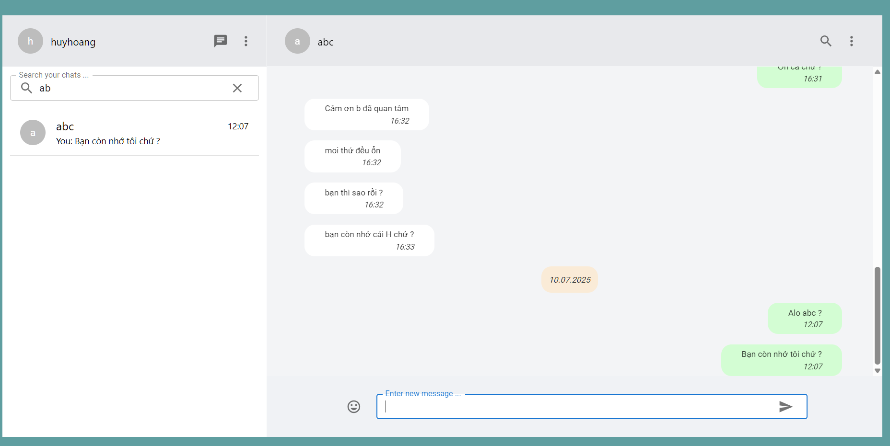
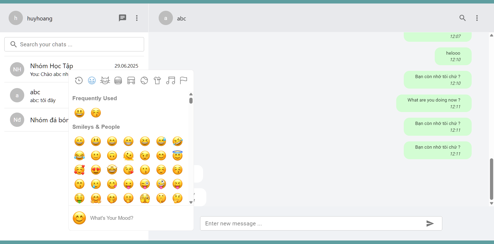
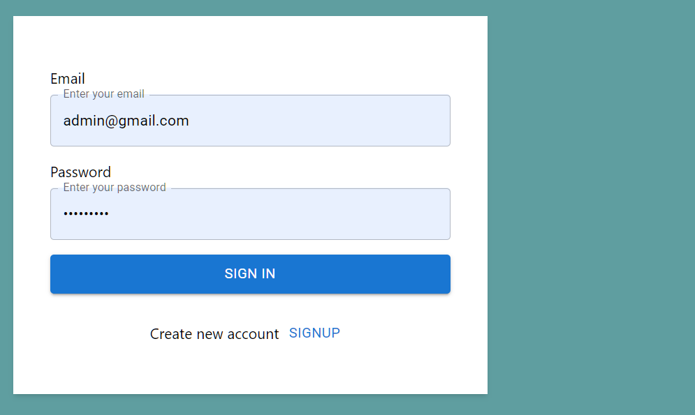
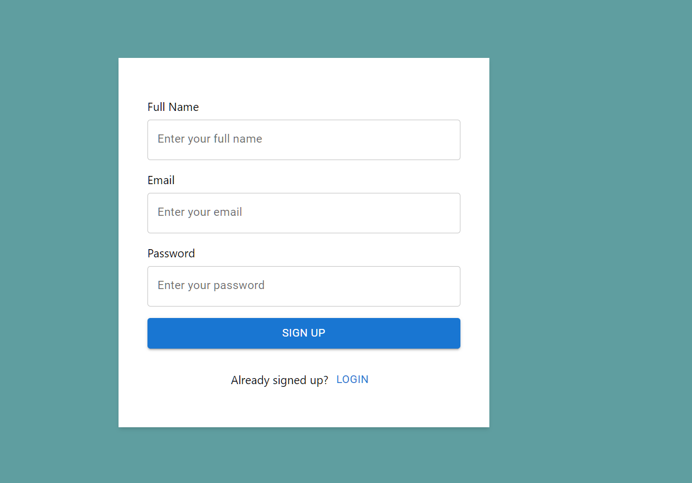
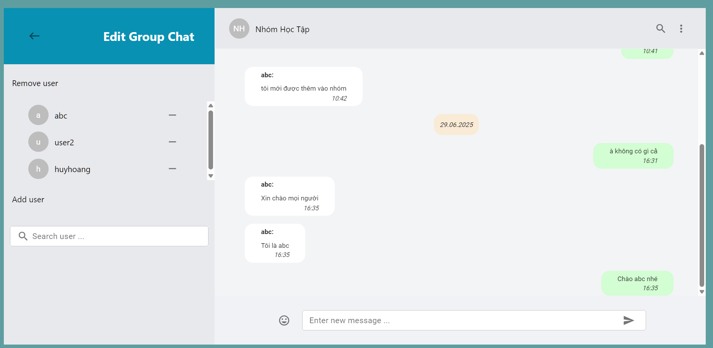

# Ứng Dụng Chat Realtime

Chào mừng bạn đến với Ứng Dụng Chat Realtime của tôi! Đây là một ứng dụng nhắn tin hoàn chỉnh với giao diện người dùng được lấy cảm hứng từ WhatsApp, cho phép người dùng trao đổi tin nhắn cá nhân hoặc trong nhóm một cách mượt mà.



## ✨ Tính Năng Nổi Bật

- **💬 Nhắn Tin Realtime:** Trải nghiệm nhắn tin mượt mà với tốc độ truyền tin nhắn tức thì
- **👤 Chat Cá Nhân:** Gửi tin nhắn riêng tư đến người dùng khác
- **👥 Chat Nhóm:** Tạo và chỉnh sửa nhóm để giao tiếp với nhiều người dùng
- **🔐 Hệ Thống Đăng Nhập:** Truy cập ứng dụng một cách an toàn với hệ thống đăng ký và đăng nhập
- **🎨 Giao Diện Hiện Đại:** Thiết kế đẹp mắt, thân thiện với người dùng
- **🔒 Bảo Mật Cao:** Xác thực bằng JWT, mã hóa dữ liệu an toàn
- **❤️ React Icon Tin Nhắn:** Thả cảm xúc (tym) cho từng tin nhắn, xem ai đã react
- **↩️ Trả Lời Tin Nhắn:** Trả lời trực tiếp một tin nhắn bất kỳ, hiển thị đoạn trích dẫn chuyên nghiệp
- **👀 Xem Danh Sách Người Đã React:** Click vào icon cảm xúc để xem danh sách người đã thả tym

## 🛠️ Công Nghệ Sử Dụng

### Frontend
- **TypeScript** - Ngôn ngữ lập trình type-safe
- **React** - Thư viện UI hiện đại
- **Redux & Redux Thunk** - Quản lý state và async actions
- **Material UI** - Thư viện component đẹp mắt
- **SCSS** - Styling nâng cao

### Backend
- **Java** - Ngôn ngữ lập trình mạnh mẽ
- **Spring Boot** - Framework phát triển ứng dụng
- **Spring Security** - Bảo mật và xác thực
- **Spring WebSocket** - Giao tiếp realtime
- **Spring Data JPA** - Truy cập dữ liệu

### Database & Khác
- **PostgreSQL** - Hệ quản trị cơ sở dữ liệu mạnh mẽ
- **JWT** - Xác thực token an toàn
- **WebSocket** - Kết nối realtime

## 🚀 Hướng Dẫn Cài Đặt

### Yêu Cầu Hệ Thống

Đảm bảo máy tính của bạn đã cài đặt:
- **Node.js** (phiên bản 14 trở lên)
- **npm** hoặc **yarn**
- **Java JDK** (phiên bản 11 trở lên)
- **Maven** (phiên bản 3.6 trở lên)
- **MySQL** 

### Bước 1: Clone Repository

```bash
git clone https://github.com/nicolasjusten95/chat-app.git
cd chat-app
```

### Bước 2: Cài Đặt Frontend

```bash
cd frontend
npm install
```

### Bước 3: Cài Đặt Backend

```bash
cd ../backend
mvn clean install
```

### Bước 4: Cấu Hình Database

1. Tạo database MySQL mới
2. Cập nhật file `backend/src/main/resources/application.properties`:
   ```properties
   spring.datasource.url=jdbc:mysql://localhost:5432/your_database_name
   spring.datasource.username=your_username
   spring.datasource.password=your_password
   ```

### Bước 5: Khởi Chạy Ứng Dụng

**Khởi động Backend:**
```bash
cd backend
mvn spring-boot:run
```

**Khởi động Frontend (terminal mới):**
```bash
cd frontend
npm start
```

### Bước 6: Truy Cập Ứng Dụng

- Mở trình duyệt và truy cập: [http://localhost:3000](http://localhost:3000)
- Đăng nhập với tài khoản mẫu:
  - **Email:** luke.skywalker@test.com
  - **Mật khẩu:** luke
- Hoặc tạo tài khoản mới và bắt đầu chat!

## 📸 Hình Ảnh Demo

### 🏠 Trang Chủ - Xem Danh Sách Chat


### 💬 Gửi Tin Nhắn


### 🔐 Đăng Nhập


### 📝 Đăng Ký Tài Khoản


### 👥 Tạo Chat Nhóm Mới


### ✏️ Chỉnh Sửa Chat


## 🎯 Tính Năng Chi Tiết

### Chat Cá Nhân
- Gửi và nhận tin nhắn realtime
- Hiển thị trạng thái online/offline
- Lịch sử tin nhắn được lưu trữ

### Chat Nhóm
- Tạo nhóm với nhiều thành viên
- Chỉnh sửa thông tin nhóm
- Quản lý thành viên nhóm

### React & Reply Tin Nhắn
- Thả cảm xúc (tym) cho từng tin nhắn
- Xem danh sách ai đã react
- Trả lời trực tiếp một tin nhắn bất kỳ, hiển thị đoạn trích dẫn chuyên nghiệp

### Bảo Mật
- Xác thực JWT an toàn
- Mã hóa mật khẩu
- Bảo vệ API endpoints

## 🤝 Đóng Góp

Tôi rất hoan nghênh mọi đóng góp! Nếu bạn có ý tưởng cải thiện hoặc tính năng mới:

1. **Fork** repository này
2. Tạo **branch** mới cho tính năng của bạn
3. **Commit** những thay đổi
4. **Push** lên branch
5. Tạo **Pull Request**

### Báo Cáo Lỗi
Nếu bạn tìm thấy lỗi, vui lòng tạo issue với:
- Mô tả chi tiết lỗi
- Các bước để tái hiện lỗi
- Thông tin hệ thống

## 📄 Giấy Phép

Dự án này được cấp phép theo [MIT License](LICENSE).

## 🙏 Lời Cảm Ơn

Cảm ơn bạn đã sử dụng và đóng góp cho Ứng Dụng Chat Realtime! 

---

**⭐ Nếu dự án này hữu ích, hãy cho tôi một ngôi sao trên GitHub!**

 
